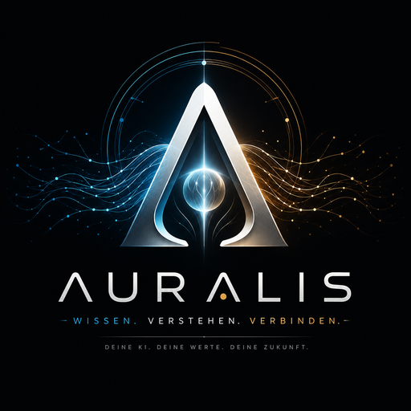
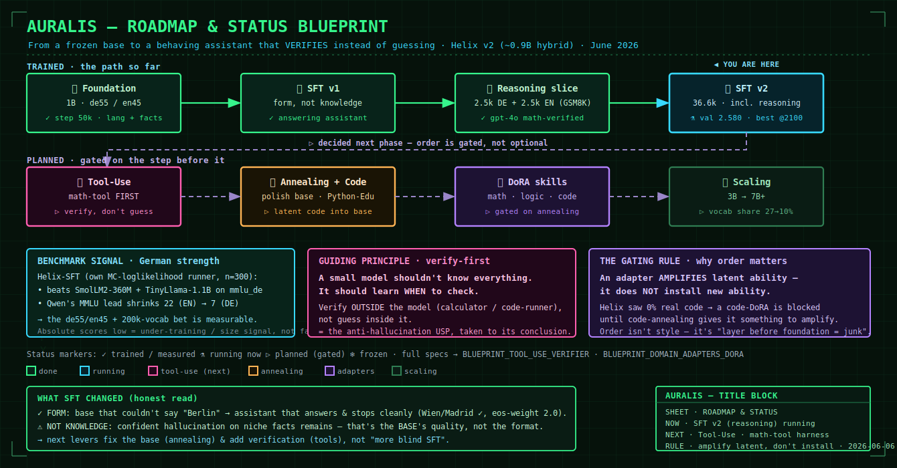

# Auralis v2 / Helix v2

<p align="center">
  <br>
  <em>Ein from-scratch, deutsch-primaeres ~0.9B-Hybrid-LLM (Mamba-2 / GLA / Sparse-Attention).</em>
</p>

Auralis ist das Assistenz-System. Helix v2 ist das eigene LLM darunter.

Der aktuelle Arbeitsstand steht in [STATUS.md](STATUS.md). Die grosse
Projektidee und Modellphilosophie stehen in
[Doc/AURALIS_V2_PROJECT_BRIEF.md](Doc/AURALIS_V2_PROJECT_BRIEF.md). Die
technische Architektur-Spec steht in
[Doc/SPECs/SPEC_PHASE_0.5_MODEL_ARCHITECTURE.md](Doc/SPECs/SPEC_PHASE_0.5_MODEL_ARCHITECTURE.md).

## Quick Links

- [Aktueller Stand](STATUS.md)
- [Roadmap & Status (Blueprint)](docs/auralis_roadmap_blueprint_en.svg)
- [Blueprint: Tool-Use & Verifier](docs/BLUEPRINT_TOOL_USE_VERIFIER.md)
- [Blueprint: DoRA-Domaenen-Adapter](docs/BLUEPRINT_DOMAIN_ADAPTERS_DORA.md)
- [Zukunft-Backlog](docs/ZUKUNFT_BACKLOG.md)
- [Doku-Index](docs/DOCS_INDEX.md)
- [Projekt-Brief / Grundidee](Doc/AURALIS_V2_PROJECT_BRIEF.md)
- [Modell-Architektur](Doc/SPECs/SPEC_PHASE_0.5_MODEL_ARCHITECTURE.md)
- [Data Cleaning Pipeline V3](docs/data_cleaning_pipeline_v3.md)
- [Dataset Market App](docs/dataset_market_app.md)
- [Evaluation](eval/README.md)
- [Lessons](LESSONS.md)
- [History](HISTORY.md)

## Aktueller Fokus (Stand 2026-06-06)

Pipeline, Checkpointing, Tokenizer und Training laufen stabil. Seit dem
deutschen Edu-Daten-Filter ist viel passiert:

1. **Foundation-Run gelaufen** (1B, de55/en45, Warmstart v3 bis Step 50k):
   gesundes Training, Sprache + Faktenbindung nachgewiesen.
2. **SFT (Instruction-Tuning):** aus dem Base, der kaum antworten konnte, wurde
   ein antwortender Assistent. v1 (~32k diverse DE+EN, gpt-4o-verifiziert,
   dekontaminiert) + v2 (+ deutscher Reasoning-Slice, gpt-4o-mathgeprueft).
   **SFT lehrt FORM, nicht WISSEN** — durch Benchmarks bestaetigt.
3. **Benchmarks** (eigener MC-Loglikelihood-Runner, n=300): Helix-SFT schlaegt
   auf `mmlu_de` SmolLM2-360M + TinyLlama-1.1B; Qwens MMLU-Vorsprung schrumpft
   von ~22 (EN) auf ~7 (DE). Die Sprachstrategie (200k Vokab, de55/en45) zahlt
   sich messbar aus. Absolutwerte niedrig = Untertrainings-/Groessen-Signal.
4. **Naechste Richtung** (dreifach abgestimmt, Reihenfolge gegated): Tool-Use
   zuerst (kleines Modell lernt PRUEFEN statt raten) -> Annealing inkl. Code
   -> DoRA-Domaenen-Adapter. Specs:
   [Tool-Use](docs/BLUEPRINT_TOOL_USE_VERIFIER.md),
   [DoRA](docs/BLUEPRINT_DOMAIN_ADAPTERS_DORA.md),
   [Backlog](docs/ZUKUNFT_BACKLOG.md).

Roadmap auf einen Blick:



Details: der "Update 2026-06-06"-Block in [STATUS.md](STATUS.md), der Verlauf
in [HISTORY.md](HISTORY.md), die Lehren (inkl. L-018..L-022) in
[LESSONS.md](LESSONS.md).

## Projekt-Struktur

```text
configs/          YAML-Configs fuer Modell, Training, Daten und Experimente
data/             lokale Daten, Audits und Zwischenartefakte
Doc/              urspruengliche Master-Specs und Phasen-Spezifikationen
docs/             aktuelle Arbeitsdoku und Experimente
eval/             Probes, Benchmarks und Eval-Dokumentation
scripts/          Download, Cleaning, Tokenize, Training, Eval, Experimente
src/auralis/      Python-Paket: Tokenizer, Modell, Training, Inference
tests/            Pytest-Suites
tokenizer/        Helix-v2-Tokenizer und Qualitaetsreport
```

## Setup

```bash
python -m venv .venv
source .venv/bin/activate
pip install -e ".[dev]"
pytest
```

Auf dem Trainingsserver laufen viele Jobs im Docker-Container
`auralis-training`. Container-Pfade beginnen dort typischerweise mit
`/workspace/v2data`.

## Grundregeln

1. Der aktuelle Status steht in `STATUS.md`, nicht in alten Phasen-Specs.
2. Specs in `Doc/SPECs/` sind Designhistorie plus Referenz, aber nicht immer
   der heutige Run-Plan.
3. Kein grosser Run ohne Audit, Tokenize-Manifest und Capability-Probes.
4. Keine Tokenizer-Aenderung ohne bewusstes Tokenizer-v2-Experiment.
5. Neue Booster wie Knowledge-DNA bleiben experimentell, bis eine Ablation
   eindeutig positiv ist.
