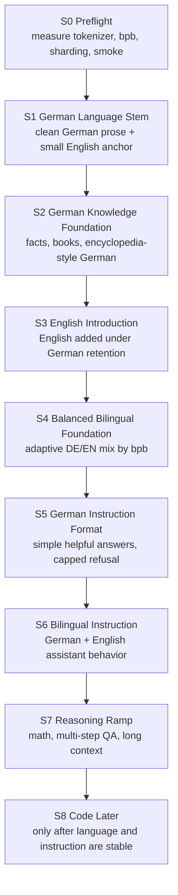

# Auralis 1B Language Tree Plan

Date: 2026-05-30

## Short Answer

The staged idea is correct. The model should not learn text, instruction behavior, refusal behavior, facts, code, and repairs all at once. The safer plan is a language tree:

1. Build a German language trunk.
2. Add German knowledge.
3. Introduce English under German retention guards.
4. Balance both languages.
5. Only then add instruction behavior.
6. Only later add harder reasoning and code.

The only correction: avoid a long pure German-only phase. Use a small English anchor from the beginning so English does not collapse and later interfere with German when it is reintroduced.

## Why This Is Better Than Mixing Everything

The 500M work showed a real failure mode: when facts, honesty, repairs, and instruction format are all pushed late onto a weak foundation, the model can improve one behavior while breaking another. That is not just a tuning issue. It means the base representation was not stable enough.

The new approach makes every stage answer one question:

- Can it write coherent text?
- Can it preserve that while adding knowledge?
- Can it add another language without forgetting the first?
- Can it follow instructions without becoming overcautious?
- Can it solve harder tasks without losing retention?

No stage should be promoted just because the net score looks better. Promotion requires no serious regression.

## Stage Tree



## Core Metric Change

Use `bits-per-byte` for language balance, not raw per-token loss.

Measured on the real corpus:

- English tokens/byte: `0.1990`
- German tokens/byte: `0.2338`
- Canary English bpb: `1.4978`
- Canary German bpb: `2.7938`
- True German/English bpb gap: `1.865x`

This means German is genuinely weaker, but not by the misleading raw per-token-loss ratio. The training tree should react to `bpb_german`, `bpb_english`, and `bpb_gap_max`.

## Promotion Discipline

Every stage needs:

- quantitative metrics: bpb, val loss, repetition rate, target/retention where applicable
- qualitative samples: short German and English free generations
- source-disjoint gates: never train on the same prompts used for promotion
- retention rule: one serious retention regression blocks promotion

## Practical Start

Use the new config:

```text
configs/curriculum/helix_1b_language_tree_v1.yaml
```

Recommended first real training move:

1. Finish data readiness for clean German prose and German knowledge.
2. Run `S1 German Language Stem` with approximately `92% German / 8% English anchor`.
3. Track `bpb_german`, `bpb_english`, `bpb_gap_max`, repetition, and sample quality.
4. Do not run SFT/repair yet.
5. Do not add code yet.

## What Not To Do

- Do not start with mixed code, refusal, facts, instruction, and repairs.
- Do not use frozen target probes as training examples.
- Do not judge German progress only by per-token loss.
- Do not promote a stage because one target improved while retention broke.
- Do not do heavy SFT before the base model can write coherent text.

## Current Status

The technical pipeline is ready enough for staged smoke/ramp work:

- 1B canary completed end-to-end.
- BPB measurement exists and showed a real German gap.
- Foundation trainer now logs bpb metrics.
- Rank-aware sharding was added for multi-GPU readiness.

The content pipeline now needs the staged curriculum and clean data preparation, not more late repair patches.
